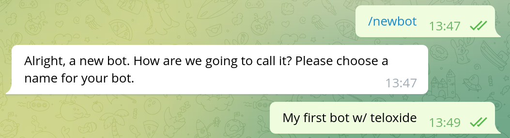
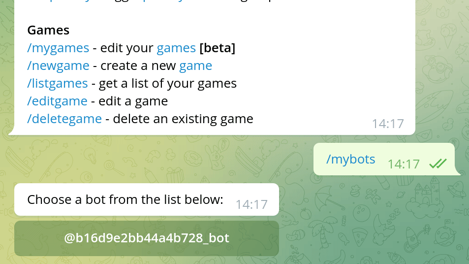

# Creating bot with BotFather

> Note: if you already know how to create a bot with BotFather, you can skip this chapter.
> There is nothing teloxide-specific in this.

To create a Telegram bot, you need to use [@BotFather].
Bot Father is a bot itself, that provides commands to manage your bots.
To create a new bot, use `/newbot` and then answer questions from Bot Father.

[@BotFather]: https://t.me/BotFather

The first question is bot name.
This is what you'll later see at the top of the chat with your bot.
The name can easily be changed later, so there is nothing to worry about.

![Dialog in telegram. BotFather: Good. Now let's choose a username for your bot. It must end in `bot`. Like this, for example: TetrisBot or tetris_bot. Author: b16d9e2bb44a4b728_bot. BotFather: Done! Congratulations on your new bot. You will find it at t.me/b16d9e2bb44a4b728_bot. You can now add a description, about section and profile picture for your bot, see /help for a list of commands. By the way, when you've finished creating your cool bot, ping our Bot Support if you want a better username for it. Just make sure the bot is fully operational before you do this.
 Use this token to access the HTTP API: 5284707973:AAEABD5lZTJ7XKqXOUnoH9tTYPDr796u4HA Keep your token secure and store it safely, it can be used by anyone to control your bot. For a description of the Bot API, see this page: https://core.telegram.org/bots/api](./img/ch-01-pic-02.png)

The second question is the bot's username, ie the @-tag with which you'll be able to mention the bot.
The username can contain a-z, A-Z, 0-9 and `_` characters and must end in a `bot` (case insensitive).
This is much more important that the name, since you can't ever change the username of the bot.
Choose wisely.

The "token to access the HTTP API" is the _bot token_ that will be used to control bot with teloxide.
As Bot Father mentions, you need to keep the token in secret, since it can be user by anyone.

In case the token somehow leaked you can change it via Bot Father.
Use `/mybots` command, then choose the bot, click "API token" and click "Revoke current token":

There are a lot of things that you can change about your bot (eg profile picture) via `/mybots` command.
You may want to check them yourself.

Some settings that affect bot capabilities:
- Bot Settings
  - Inline Mode (allows to use bot in any chat by typing `@username_of_the_bot ...`)
  - Allow Groups? (you can disallow addition of the bot to groups)
  - Group privacy (see [privacy mode])
  - Payments (allows to accept payments through bot)
  - Domain (allows to you to use telegram to identify users on your site)

[privacy mode]: https://core.telegram.org/bots#privacy-mode
