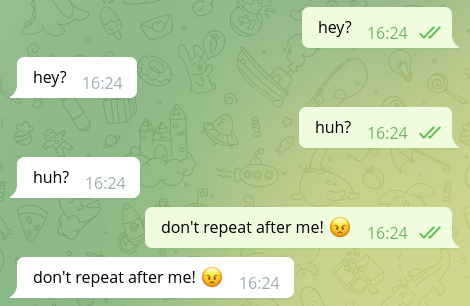

# Writing your first bot with teloxide

In order to use teloxide you first need to create a Rust project with [`cargo`]:

```shell
$ cargo new my-first-bot --bin
```

> Note: this book assumes that you already have basic knowledge of Rust and have `cargo` installed.
> If you don't have it, we recommend reading [The Rust Book].

[`cargo`]: https://doc.rust-lang.org/cargo/
[The Rust Book]: https://doc.rust-lang.org/book/

Teloxide is an async library, so in order to use it you need an async runtime like [`tokio`].
Add `tokio` and `teloxide` dependencies to `Cargo.toml` generated by `cargo new`:

[`tokio`]: http://tokio.rs

```toml
# Cargo.toml

[dependencies]
tokio = { version = "1.17", features = ["rt-multi-thread", "macros"] }
teloxide = "0.9"
```

> Note: teloxide currently requires `tokio` and won't work with other runtimes.

Now you can start writing your bot.
First, you'll need to create an async entry point to the program:

```rust,no_run
// This is needed to run `async` main function via tokio runtime
#[tokio::main]
// Returning result from main allows for easier error handling
async fn main() -> Result<(), Box<dyn std::error::Error>> {
    // ...
    Ok(())
}
```

Then, you can create a bot using [`Bot::new`] and `auto_send` extension
(we'll cover what `auto_send` does in later chapters):

[`Bot::new`]: https://docs.rs/teloxide/latest/teloxide/struct.Bot.html#method.new

```rust,no_run
use teloxide::prelude::*;

# #[tokio::main]
# async fn main() -> Result<(), Box<dyn std::error::Error>> {
# 
// Replace TOKEN with the token you've got when creating the bot
let bot = Bot::new("TOKEN").auto_send();
# 
#     Ok(())
# }
```

Then, try sending yourself a message:

```rust,no_run
# use teloxide::{prelude::*, ChatId};
# #[tokio::main]
# async fn main() -> Result<(), Box<dyn std::error::Error>> {
#     let bot = Bot::new("TOKEN").auto_send();
# 
// replace 0 with your user id
let your_id = ChatId(0);
bot
    .send_message(your_id, "Hi!")
    // `.await` is needed to wait for an async operation
    // `?` propagates possible errors
    .await?;   
#  
#     Ok(())
# }
```

> Note: you can get your id from [@ShowJsonBot] (message -> from -> id).

> Note: Telegram bots can't initiate a dialog, so you need to write to the bot first.

[@ShowJsonBot]: https://t.me/ShowJsonBot

Now you can run the bot and it should send you a "Hi!" message:


## Managing bot token

Keeping the bot token in source code is not a good idea for multiple reasons:
1. every time you'll want to change the token (e.g. to move from the test bot to a production one) you'd need to recompile the program
2. It's easy to accidentally commit the token that is inside the source code into a VCS like git

Instead, you normally either pass the token as a command line argument or via environment variables.
For the latter teloxide provides a handy `Bot` constructor -- [`Bot::from_env`].
It gets the token from the `TELOXIDE_TOKEN` environment variable.

[`Bot::from_env`]: https://docs.rs/teloxide/latest/teloxide/struct.Bot.html#method.from_env

```rust,no_run
# use teloxide::prelude::*;
let bot = Bot::from_env().auto_send();
```

## Reacting to users

A bot that just sends messages may be all you need, but often you want to react to the user's input.
For this `teloxide` provides a variety of constructs.
The simplest option to process user's input is called "repl".

To use it you just need to provide a bot and a function to it.
Then, the function will be executed on each message from the user:

```rust,no_run
# use teloxide::prelude::*;
# #[tokio::main]
# async fn main() -> Result<(), Box<dyn std::error::Error>> {
#     let bot = Bot::new("TOKEN").auto_send();
# 
teloxide::repl(bot, |message: Message, bot: AutoSend<Bot>| async move {
    // There are non-text messages, so we need to use pattern matching
    if let Some(text) = message.text() {
        // Echo text back into the chat
        bot.send_message(message.chat.id, text).await?;
    }

    // respond is an alias to `Ok()` with a error type compatible with teloxide
    respond(())
}).await;
#  
#     Ok(())
# }
```



To stop the bot running in a `repl`, you can press `ctrl` + `C`.
Note that it can take some time to stop the bot.
